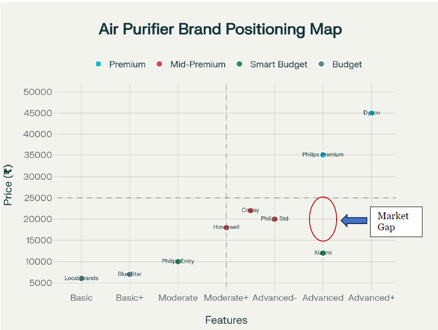

# About the Project:

## Project Name:
 - India Air Purifier Market Dashboard: Trends, Features & Gaps

## Introduction:

**AirPure Innovations** is a startup responding to India’s air quality crisis, where 14 of the world’s top 20 most polluted cities are located.  
Before committing to R&D and production, the company needs insights on pollutants, essential features, target markets, and consumer demand.  

This project builds an **interactive Power BI dashboard** combining AQI, health, consumer behavior, and competitor data to guide strategic decisions.

## Domain:
 - Market Research & Consumer Insights

## Problem Statement:

The company faces uncertainty in product design and market prioritization. Key questions addressed include:

1. Which pollutants should the purifier target?  
2. What essential features are most adopted across competitors?  
3. Which cities/states show highest demand and risk?  
4. How do health outcomes, population, and behavior trends link to AQI?  
5. Where do feature and pricing gaps exist in the market?  

## Tools Used:
 - Microsoft Excel – Initial Demographic Analysis 
 - Python Scripting – Google Trends & AQI Analysis  
 - Power BI – Dashboard & Visuals  
 - Secondary Research – Competitor Pricing & Features  

## Methodologies Used:
 - Data Cleaning & Wrangling  
 - Exploratory Data Analysis  
 - Risk Scoring
 - Feature Gap Analysis  
 - Consumer Behavior Correlation  
 - Data Visualization
 - Documentation

## Data Description

This project uses **10 datasets** covering air quality, health outcomes, demographics, consumer behavior, and competitor features.  
Each dataset serves a specific purpose in building the dashboard:

1. **aqi** – Daily AQI values across Indian cities (2022–2025) with pollutants and air quality status.  
   *Purpose:* Track pollution trends, identify worst/best cities, seasonal patterns.  

2. **idsp_cleaned** – Health surveillance data (diseases, cases, deaths) by state and district.  
   *Purpose:* Link air quality with health outcomes such as asthma and respiratory illnesses.  

3. **india_air_purifiers_10k_30k_comprehensive** – Detailed competitor dataset of air purifiers in ₹10k–30k range (features, CADR, coverage, price, warranty).  
   *Purpose:* Competitor & feature gap analysis.  

4. **market_size** – Secondary research data on market share and sales by company (Business Standard & industry reports).  
   *Purpose:* Benchmark competitor performance and market positioning.  

5. **per_capita_income** – State-level income data (2024).  
   *Purpose:* Used in risk scoring model with AQI × Population × Income.  

6. **population_projection** – Monthly population data (2015–2032) at the state level.  
   *Purpose:* Estimate demand potential and compute risk scores for 2024.  

7. **priority_cities_irreversible** – Cities flagged for irreversible AQI degradation (baseline vs latest trends).  
   *Purpose:* Identify Tier-1 & Tier-2 cities with highest product adoption potential.  

8. **state_asthma** – Asthma burden by state, sex, and age group.  
   *Purpose:* Correlate pollution exposure with disease prevalence.  

9. **vahan** – Vehicle registration and fuel type data by state and RTO.
   *Purpose:* Understand EV adoption trends and their effect on AQI. 

10. **age_group_affected** – Health outcomes segmented by age and cause.  
    *Purpose:* Identify vulnerable age groups (children, elderly) most impacted by air pollution.

## Major Metrics

This project builds several calculated metrics to turn raw data into actionable insights:

1. **Current AQI (Latest Value)** – Most recent AQI for each city/state.  

2. **Top 5 / Bottom 5 Cities (Last 6 Months)** – Identifies pollution hotspots and best performers.  

3. **National AQI Trend (12 Months)** – Rolling AQI average for trend monitoring.  

4. **State Risk Score** = Avg AQI × (Population ÷ 1M) × (Income ÷ 10k)  
   *Composite risk index to prioritize states.*  

5. **Feature Count (per Model)** – Number of features per purifier model.  

6. **% Feature Adoption** – Market penetration of each feature (used in Feature Gap Matrix).  

7. **Price per CADR** – Normalized efficiency measure (₹ per m³/h).   

## Initial Demographic Analysis

This section explores demographic and regional insights using AQI, health, and behavioral datasets.

---

### Query 1: Age Group Demographics and Health Outcomes

  

**Insight:** Elderly (65+) and children (0–4) are the most vulnerable groups to air pollution-related diseases, while 15–39 and 5–14 age groups face lower risks across cities.

---

### Query 2: Seasonal Air Quality Patterns

  

**Insight:** AQI peaks during winter months (Nov–Jan) across most states due to crop burning, reduced atmospheric dispersion, and heating fuel use.

---

### Query 3: Electric Vehicle Adoption and Air Quality

  

**Insight:** Top EV-adoption states include Uttar Pradesh, Maharashtra, Karnataka, Tamil Nadu, and Rajasthan. EV adoption shows some link to better AQI, but the relationship isn’t statistically strong without controlling for confounders.

---

### Query 4: Population vs AQI

  

**Insight:** Population size alone doesn’t determine air quality—urban planning, industrial activity, and traffic density are stronger drivers. Well-managed large cities can outperform smaller industrial hubs.

---

### Query 5: Priority Cities for Air Purifier Adoption

  

**Insight:** Cities showing irreversible AQI degradation (baseline vs latest with trend) are flagged as **priority markets** for air purifier adoption.

---

### Query 6: Prominent Pollutants in Southern India

  

**Insight:** PM10 and PM2.5 are the dominant pollutants across southern states (post-2022), indicating consistent regional pollution profiles.

---

### Query 7: Extreme AQI Areas (Last 6 Months)

  

**Insight:**  
- **Top 5 polluted areas:** Bahadurgarh, Byrnihat, Delhi, Hajipur, Sonipat  
- **Bottom 5 areas:** Chamarajanagar, Palkalaiperur, Vijayapura, Madikeri, Tirunelvel

---

### Query 8: Weekend vs Weekday AQI in Metro Cities

  

**Insight:** 5 of 8 metros show improved AQI on weekends due to lower traffic/industry. Delhi shows the largest drop (209 → 199).

---

## Perceptual Positioning

This positioning map compares air purifier brands across **features vs. price**.  
It highlights how brands cluster into **Premium, Mid-Premium, Smart Budget, and Budget** categories, and identifies an untapped **market gap**.

  

**Insight:**  
Most competitors cluster at either low-feature/low-price or high-feature/high-price segments.  
The **Advanced Features + Mid-Price (~₹15k–25k)** range shows a clear **market gap**, presenting a strong opportunity for AirPure Innovations to position a differentiated product.

## Power BI Dashboard Preview

The interactive **Power BI dashboard** integrates AQI, demographics, health outcomes, consumer behavior, and competitor features into a single decision-support tool.

---

### 1. National AQI & Trends

  

**Insight:** Tracks current AQI, 6-month averages, and 12-month trends to monitor pollution patterns across India.

---

### 2. State Risk Score

  

**Insight:** Identifies top-risk states using the composite **Risk Score = AQI × Population × Income**, and flags Tier-1 & Tier-2 cities with irreversible AQI degradation.

---

### 3. Competitor Benchmarking

  

**Insight:** Benchmarks competitors by **market share, pricing, and features**, revealing brand strengths and weaknesses.

---

### 4. Feature Gap Matrix & Price-Feature Analysis

  

**Insight:** Maps feature adoption across price segments. Highlights gaps such as **IoT, UV Sterilization, and Voice Control**, which are under-adopted but trending in consumer demand.

---

### 🔑 Dashboard Highlights
- **National AQI Tracker:** Current, 6-month, and 12-month trend monitoring.  
- **Risk Scoring Model:** Prioritization of states & cities for product launch.  
- **Consumer Behavior Correlation:** AQI vs Google Trends search interest.  
- **Competitor Landscape:** Market share, pricing, and product positioning.  
- **Feature Gap Matrix:** Detects underserved features for innovation.  

---

**Takeaway:**  
This dashboard enables **data-driven market entry strategy** by linking environmental risk, health outcomes, and consumer demand with **competitor gaps** — helping AirPure Innovations decide **where to launch, what to build, and how to price**.

## Key Insights & Recommendations

Based on demographic analysis, consumer behavior, and market intelligence, the following insights and strategic recommendations emerge:

### 🔑 Key Insights
- **Demographic Vulnerability:** Elderly (65+) and children (0–4) are the most affected by pollution; purchase decisions are often made by adults aged 25–45 for family protection.  
- **Seasonal Patterns:** AQI peaks in winter (Nov–Jan), with **50%+ of annual sales concentrated post-Diwali**, making inventory and marketing timing critical.  
- **Geographic Priority:** Delhi-NCR leads with extreme risk scores, followed by Maharashtra and Gujarat. Tier-2 industrial hubs (Pune, Gurgaon) show rising risk despite smaller populations.  
- **Awareness Gap:** 46% of Indians remain unaware of AQI; awareness is lowest among lower-income groups (90% unaware) and in smaller cities.  
- **Behavioral Link:** AQI spikes strongly correlate with Google Trends search interest (0.50 coefficient), confirming pollution episodes drive immediate purchase intent.  
- **Competitive Landscape:** Market is fragmented — top 3 brands hold only 46% share, leaving space for differentiated entrants. Feature gaps exist in **power management, filter maintenance, and sensor accuracy**.  
- **Perceptual Positioning:** Clear market gaps in **Advanced Budget (<₹10k)** and **Moderate Mid-Premium (₹15k–20k)** segments.

### 📌 Strategic Recommendations
- **Target Segment:** Enter the **Mid-Premium Health-Conscious Segment** (~₹18,000) with 8/10 features and India-specific adaptations.  
- **Core Product Features:**  
  - H13 HEPA + Washable Pre-Filter  
  - Power management (auto-restart, surge protection)  
  - Accurate sensors with humidity compensation  
  - Real-time AQI + health alerts  
  - Hybrid controls (app + remote + voice, with Hindi support)  
- **Geographic Rollout:**  
  - **Phase 1:** Delhi-NCR, Mumbai, Bangalore (high risk + high purchasing power)  
  - **Phase 2:** Pune, Chennai, Hyderabad (growing demand + Tier-2 expansion)  
- **Marketing Focus:**  
  - Education-first campaigns (“What is AQI?”) for awareness gaps  
  - Family protection positioning (“Protect children & elderly from weekday pollution”)  
  - Seasonal campaigns pre-Diwali (Sept–Oct) to capture peak sales period  
- **Competitive Edge:** Build trust through transparent claims, low-maintenance design, and India-specific engineering.

---

**Conclusion:**  
The Indian air purifier market is projected to grow from **₹778 crore (2024) to ₹3,520 crore (2030)** at **16.3% CAGR**. Success requires **education-first marketing, mid-premium positioning, and localized feature innovation**.  

