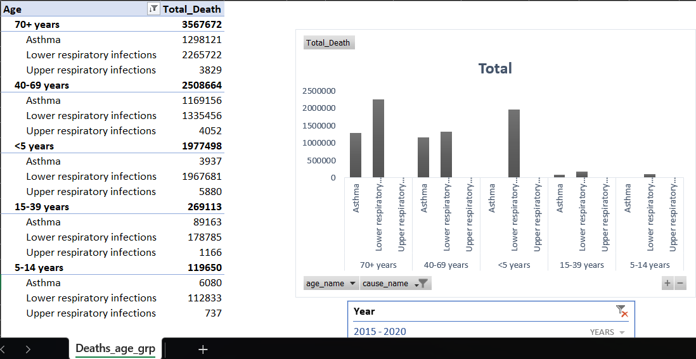
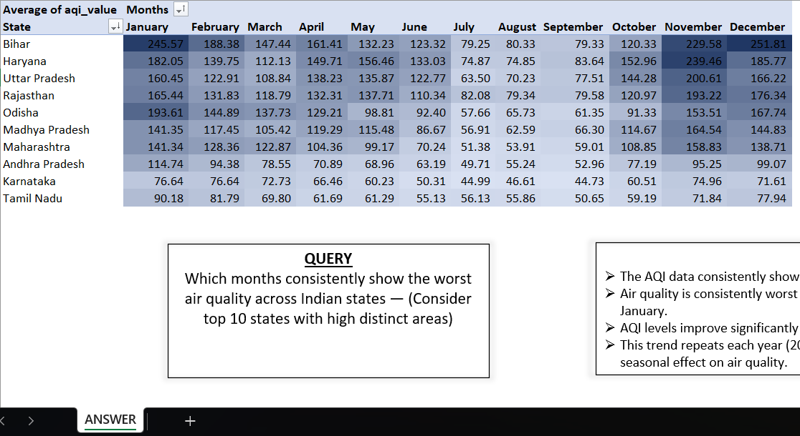
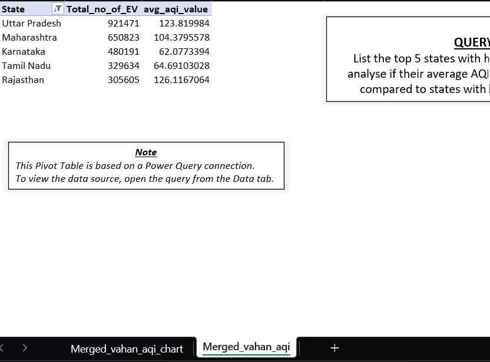
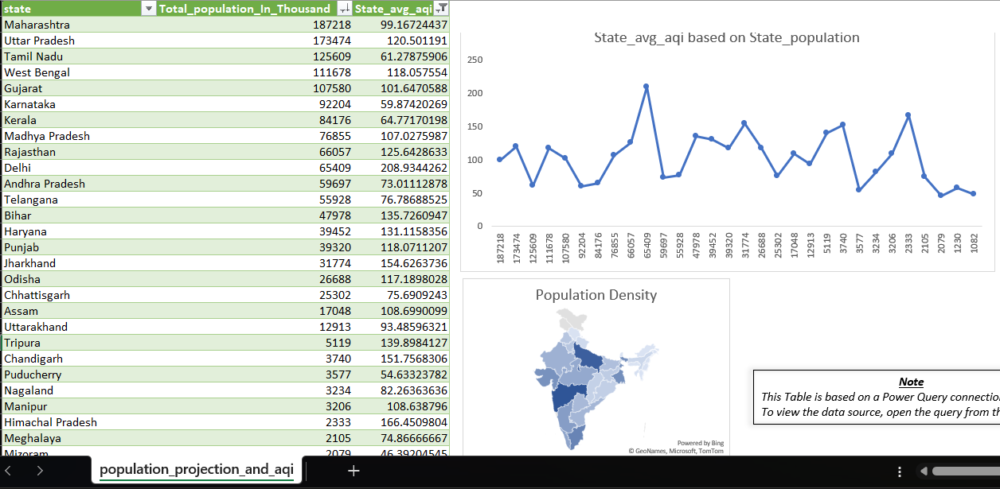
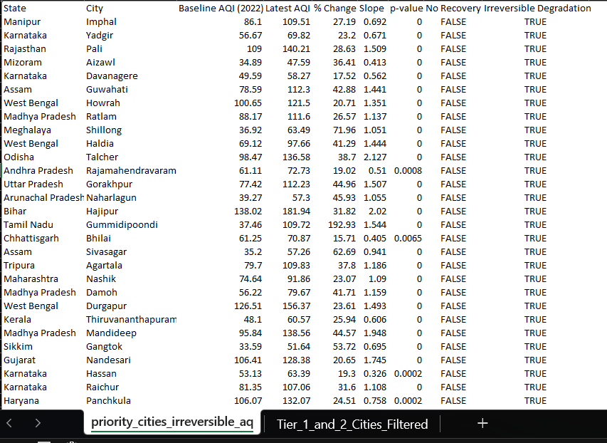
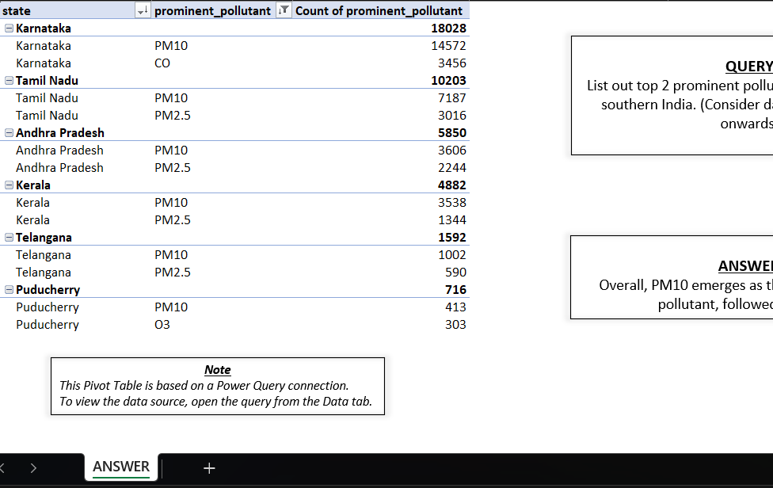
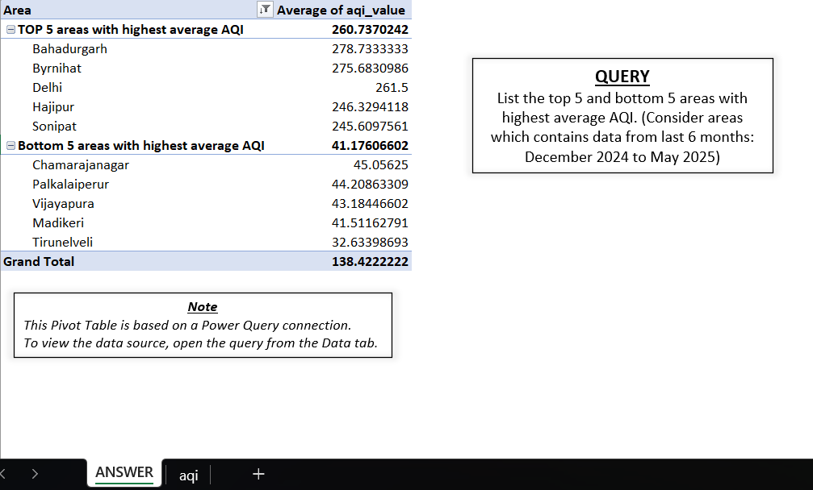
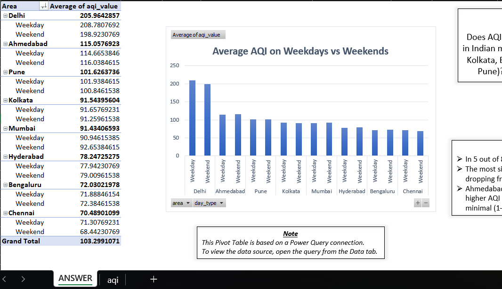

# About the Project:

## Project Name:
 - India Air Purifier Market Dashboard: Trends, Features & Gaps

## Introduction:

**AirPure Innovations** is a startup responding to India’s air quality crisis, where 14 of the world’s top 20 most polluted cities are located.  
Before committing to R&D and production, the company needs insights on pollutants, essential features, target markets, and consumer demand.  

This project builds an **interactive Power BI dashboard** combining AQI, health, consumer behavior, and competitor data to guide strategic decisions.

## Domain:
 - Market Research & Consumer Insights

## Problem Statement:

The company faces uncertainty in product design and market prioritization. Key questions addressed include:

1. Which pollutants should the purifier target?  
2. What essential features are most adopted across competitors?  
3. Which cities/states show highest demand and risk?  
4. How do health outcomes, population, and behavior trends link to AQI?  
5. Where do feature and pricing gaps exist in the market?  

## Tools Used:
 - Microsoft Excel – Initial Demographic Analysis 
 - Python Scripting – Google Trends & AQI Analysis  
 - Power BI – Dashboard & Visuals  
 - Secondary Research – Competitor Pricing & Features  

## Methodologies Used:
 - Data Cleaning & Wrangling  
 - Exploratory Data Analysis  
 - Risk Scoring
 - Feature Gap Analysis  
 - Consumer Behavior Correlation  
 - Data Visualization
 - Documentation

## Data Description

This project uses **10 datasets** covering air quality, health outcomes, demographics, consumer behavior, and competitor features.  
Each dataset serves a specific purpose in building the dashboard:

1. **aqi** – Daily AQI values across Indian cities (2022–2025) with pollutants and air quality status.  
   *Purpose:* Track pollution trends, identify worst/best cities, seasonal patterns.  

2. **idsp_cleaned** – Health surveillance data (diseases, cases, deaths) by state and district.  
   *Purpose:* Link air quality with health outcomes such as asthma and respiratory illnesses.  

3. **india_air_purifiers_10k_30k_comprehensive** – Detailed competitor dataset of air purifiers in ₹10k–30k range (features, CADR, coverage, price, warranty).  
   *Purpose:* Competitor & feature gap analysis.  

4. **market_size** – Secondary research data on market share and sales by company (Business Standard & industry reports).  
   *Purpose:* Benchmark competitor performance and market positioning.  

5. **per_capita_income** – State-level income data (2024).  
   *Purpose:* Used in risk scoring model with AQI × Population × Income.  

6. **population_projection** – Monthly population data (2015–2032) at the state level.  
   *Purpose:* Estimate demand potential and compute risk scores for 2024.  

7. **priority_cities_irreversible** – Cities flagged for irreversible AQI degradation (baseline vs latest trends).  
   *Purpose:* Identify Tier-1 & Tier-2 cities with highest product adoption potential.  

8. **state_asthma** – Asthma burden by state, sex, and age group.  
   *Purpose:* Correlate pollution exposure with disease prevalence.  

9. **vahan** – Vehicle registration and fuel type data by state and RTO.

## Major Metrics

This project builds several calculated metrics to turn raw data into actionable insights:

1. **Current AQI (Latest Value)** – Most recent AQI for each city/state.  

2. **Top 5 / Bottom 5 Cities (Last 6 Months)** – Identifies pollution hotspots and best performers.  

3. **National AQI Trend (12 Months)** – Rolling AQI average for trend monitoring.  

4. **State Risk Score** = Avg AQI × (Population ÷ 1M) × (Income ÷ 10k)  
   *Composite risk index to prioritize states.*  

5. **Feature Count (per Model)** – Number of features per purifier model.  

6. **% Feature Adoption** – Market penetration of each feature (used in Feature Gap Matrix).  

7. **Price per CADR** – Normalized efficiency measure (₹ per m³/h).  

   *Purpose:* Understand EV adoption trends and their effect on AQI.  

11. **age_group_affected** – Health outcomes segmented by age and cause.  
    *Purpose:* Identify vulnerable age groups (children, elderly) most impacted by air pollution.

## Initial Demographic Analysis

This section explores demographic and regional insights using AQI, health, and behavioral datasets.  

---

### Query 1: Age Group Demographics and Health Outcomes  
**Photo:**   
**Insight:** Elderly (65+) and children (0–4) are the most vulnerable groups to air pollution-related diseases, while 15–39 and 5–14 age groups face lower risks across cities.  

---

### Query 2: Seasonal Air Quality Patterns  
**Photo:**   
**Insight:** AQI peaks during winter months (Nov–Jan) across most states due to crop burning, poor atmospheric dispersion, and heating fuel use.  

---

### Query 3: Electric Vehicle Adoption and Air Quality  
**Photo:**   
**Insight:** Top EV adoption states include Uttar Pradesh, Maharashtra, Karnataka, Tamil Nadu, and Rajasthan. While EV adoption shows some link to better AQI, the correlation is not statistically strong without controlling for other factors.  

---

### Query 4: Population vs AQI  
**Photo:**   
**Insight:** Population size alone does not determine poor air quality — urban planning, industrial activity, and traffic density are stronger factors. Large well-managed cities can perform better than smaller industrial hubs.  

---

### Query 5: Priority Cities for Air Purifier Adoption  
**Photo:**   
**Insight:** Cities with irreversible AQI degradation (based on baseline vs current AQI trends) are flagged as **priority adoption markets** for air purifiers.  

---

### Query 6: Prominent Pollutants in Southern India  
**Photo:**   
**Insight:** PM10 and PM2.5 are the dominant pollutants across southern states (post-2022), showing regional consistency in pollution drivers.  

---

### Query 7: Extreme AQI Areas (Last 6 Months)  
**Photo:**   
**Insight:** Top 5 polluted areas: Bahadurgarh, Byrnihat, Delhi, Hajipur, Sonipat.  
Bottom 5 areas: Chamarajanagar, Palkalaiperur, Vijayapura, Madikeri, Tirunelvel.  

---

### Query 8: Weekend vs Weekday AQI in Metro Cities  
**Photo:**   
**Insight:** 5 out of 8 metros see improved AQI on weekends due to reduced traffic and industry. Delhi shows the largest drop (209 → 199 AQI).  

---

